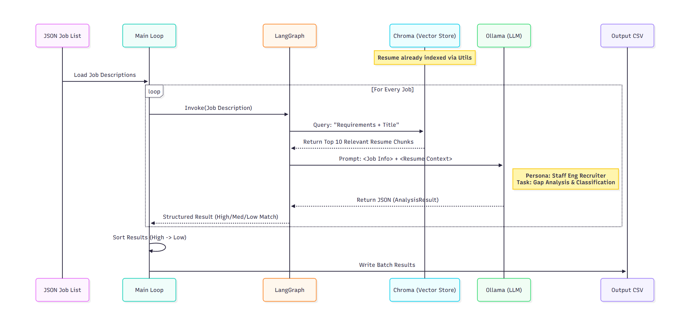

# AI Resume Matcher & Gap Analyzer

## 📖 Overview

This project is a privacy-focused, local **Batch RAG (Retrieval-Augmented Generation)** pipeline designed to automate technical resume screening.

Instead of sending personal data to cloud APIs, this system runs locally using **Ollama** and **ChromaDB**. It indexes a PDF resume, performs semantic searches against a database of job descriptions, and provides a structured "Gap Analysis" detailing exactly why a candidate matches (or doesn't match) a role.

## 🏗 System Architecture


The application is built on a modular "Agentic" workflow with **multi-provider support**:

* **Orchestration:** [LangGraph](https://langchain-ai.github.io/langgraph/) (Manages the state between retrieval and analysis nodes).
* **LLM Inference:** 
  - [Ollama](https://ollama.com/) (Local models: `gpt-oss`, `llama3`, `mistral`, etc.)
  - [OpenAI API](https://openai.com/) (Cloud-based: `gpt-4o`, `gpt-4-turbo`, etc.)
  - [vLLM](https://docs.vllm.ai/) (Alternative open-source inference server)
* **Vector Store:** [ChromaDB](https://www.trychroma.com/) (For local RAG; bypassed when using cloud providers).
* **Embeddings:** HuggingFace (`all-MiniLM-L6-v2`) via `sentence-transformers`.
* **Validation:** Pydantic (Enforces strict JSON schema for the AI output).
* **Self-Correction:** Built-in reflection/critique loop to detect and fix LLM hallucinations.

---

## 🤖 Advanced Features

### LLMFactory: Multi-Provider Abstraction

The `LLMFactory` class handles provider-specific configurations:

```python
from cv_matcher.agent import LLMFactory

# Works seamlessly across providers
llm = LLMFactory.get_llm(
    provider="openai",      # or "ollama", "vllm"
    model_name="gpt-4o",    # Provider-specific model name
    json_mode=True,         # JSON-constrained output
    temperature=0.1
)
```

**Supported Providers:**
- `"openai"`: Uses OpenAI API with optional JSON mode
- `"ollama"`: Local or remote Ollama server with format=json support
- `"vllm"`: Compatible with vLLM API endpoints

### Self-Correction Loop (Agent Mode)

The agent workflow includes an intelligent critique system:

1. **Generate**: LLM creates initial analysis JSON
2. **Audit**: Separate LLM reviews the analysis against resume context
3. **Detect**: Identifies hallucinations (claimed skills that don't exist in resume)
4. **Revise**: Reroutes to generation with critique feedback (up to 3 times)
5. **Export**: Final validated result

This ensures higher accuracy, especially with complex job requirements.

### Token Usage Tracking (OpenAI)

When using `python -m cv_matcher.agent` with OpenAI:
- Each analysis step records prompt and completion tokens
- Token counts accumulate through the revision loop
- `token_usage_report.csv` enables cost tracking and optimization

Example workflow cost calculation:
- 100 jobs × ~400 tokens per job = ~40,000 tokens ≈ $0.12 (with GPT-4o)

---

## 📁 Directory Structure (Updated)

```text
.
├── config.json               # All configuration (paths, models, hyperparameters)
├── example.json              # Example job JSON for testing
├── requirements.txt          # Python dependencies
├── environment.yml           # Conda environment spec
├── image.png                 # Architecture diagram
│
├── src/
│   └── cv_matcher/           # Main Python package
│       ├── __init__.py
│       ├── utils.py          # Config class, ResumeIngestor, shared types
│       ├── main.py           # Primary batch analysis script (use this to run)
│       ├── agent.py          # Advanced agentic workflow with reflection loop
│       ├── update_cv.py      # Single-job gap analysis utility
│       └── cv_ai.py          # Standalone prototype / legacy script
│
└── data/
    ├── raw/                  # Your resume PDF(s)
    ├── jobs/                 # Job JSON files
    ├── output/               # Generated CSV reports
    └── chroma_db/            # Auto-generated vector database
```

---

## ⚙️ Prerequisites

1. **Python 3.10+**
2. **Ollama** (for local inference): Download from [ollama.com](https://ollama.com)
   - *Optional: Only needed if `LLM_PROVIDER` is set to `"ollama"` in config.json*
3. **OpenAI API Key** (for cloud-based inference):
   - Set `LLM_PROVIDER: "openai"` in config.json and provide `OPENAI_API_KEY` in your `.env` file
   - *Optional: Only needed if using cloud models*
4. **vLLM Server** (alternative inference):
   - Run your own vLLM server and configure the endpoint in config.json
   - *Optional: Only if using vLLM provider*

---

## 🚀 Installation & Setup

1. **Clone the Repository**
   ```bash
   git clone <your-repo-url>
   cd <your-repo-folder>
   ```

2. **Install Dependencies**
   ```bash
   pip install -r requirements.txt
   ```

   Or with conda:
   ```bash
   conda env create -f environment.yml
   conda activate <env-name>
   ```

3. **Install the Package (required for `src/` layout)**
   ```bash
   pip install -e .
   ```
   This registers `cv_matcher` on your Python path so `python -m cv_matcher.main` or `python -m cv_matcher.agent` works.

4. **Configure Environment Variables (for cloud providers)**
   Create a `.env` file in the project root if using OpenAI or other cloud providers:
   ```bash
   OPENAI_API_KEY=your_openai_key_here
   VLLM_API_KEY=your_vllm_key_here  # Optional, for vLLM provider
   ```

5. **Place Your Files**
   - Copy your **resume PDF** to `data/raw/` and update `RESUME_FILE` in `config.json`.
   - Copy your **jobs JSON** to `data/jobs/` and update `JOBS_FILE` in `config.json`.

6. **Start Local Services** (if using Ollama)
   ```bash
   # Start the Ollama server
   ollama serve
   
   # In another terminal, pull your desired model
   ollama pull gpt-oss:20b  # Default model
   ```

---

## ⚙️ Configuration

All settings are centralized in `config.json` at the project root.

| Variable | Default | Description |
| --- | --- | --- |
| `LLM_PROVIDER` | `ollama` | LLM provider: `"ollama"`, `"openai"`, or `"vllm"` |
| `LLM_MODEL` | `gpt-oss:20b` | Model name for Ollama (e.g., `llama3`, `mistral`, `neural-chat`) |
| `GPT_MODEL` | `gpt-4o` | Model name for OpenAI (e.g., `gpt-4o`, `gpt-4-turbo`, `gpt-3.5-turbo`) |
| `EMBEDDING_MODEL` | `all-MiniLM-L6-v2` | HuggingFace model for vectorizing text. |
| `RESUME_FILE` | `./data/raw/CV.md.pdf` | Path to the candidate's PDF resume. |
| `JOBS_FILE` | `./data/jobs/processed_jobs_schema.json` | Path to the JSON file containing job listings. |
| `VECTOR_DB_PATH` | `./data/chroma_db` | Path to persist the ChromaDB vector store (local only). |
| `OUTPUT_DIR` | `./data/output` | Directory where CSV reports are saved. |
| `CHUNK_SIZE` | `500` | Character limit for splitting the resume (local RAG only). |
| `CHUNK_OVERLAP` | `50` | Character overlap between chunks (local RAG only). |
| `RETRIEVER_K` | `8` | Number of resume chunks to retrieve per query (local RAG only). |

---

## 📝 Data Preparation

### 1. The Resume

Place your PDF resume in `data/raw/`. Update `config.json` to match the filename:
```json
"RESUME_FILE": "./data/raw/your_resume.pdf"
```

### 2. The Jobs JSON

The system expects a JSON list of job objects in `data/jobs/`. The logic specifically looks for `job_title` and `requirements` (or `description`) fields.

See `example.json` for the expected format:

```json
[
  {
    "job_title": "Senior Python Developer",
    "department": "Engineering",
    "requirements": "Must have 5+ years of Python, Django, and AWS experience..."
  }
]
```

---

## 🏃 Usage

### Primary Scripts

**Option 1: Basic Analysis** (Recommended for local inference)
```bash
python -m cv_matcher.main
```
- Uses `LLM_PROVIDER` and `LLM_MODEL` from `config.json`
- For local Ollama: Enables RAG (Vector Search) for efficient retrieval
- For cloud providers: Disables RAG and loads the full resume text

**Option 2: Advanced Agentic Workflow** (With self-correction)
```bash
python -m cv_matcher.agent
```
- Includes a built-in **reflection/critique loop**
- Automatically detects and fixes LLM hallucinations
- Up to 3 revision attempts per job if hallucinations are found
- Tracks token usage for cloud providers (OpenAI)
- Exports a separate `token_usage_report.csv` for cost tracking

### Multi-Provider Support

The pipeline automatically adapts based on your `config.json` settings:

| Provider | Behavior | Best For |
| --- | --- | --- |
| **Ollama** (local) | Enables RAG + Vector Search | Privacy-first, cost-free inference |
| **OpenAI** (cloud) | Disables RAG, uses full resume | Fast, high-quality analysis |
| **vLLM** (local/cloud) | Enables RAG + Vector Search | Self-hosted open-source models |

### Execution Flow

When you run either script, the pipeline follows these steps:

1. **Initialization:**
   - Reads `LLM_PROVIDER` from `config.json`
   - For **Ollama/vLLM**: Creates a ChromaDB vector store and ingests the resume PDF
   - For **OpenAI**: Loads the full resume text directly (RAG bypassed for efficiency)

2. **Batch Processing:**
   - Iterates through all jobs in `JOBS_FILE`
   - For **local providers**: Uses RAG to retrieve relevant resume chunks per job
   - For **cloud providers**: Uses the full resume text with LLM's context window

3. **Analysis:**
   - Generates structured JSON output with:
     - `match_classification`: "Strong Match", "Good Match", or "No Match"
     - `missing_critical_skills`: Required skills not found in resume
     - `missing_soft_skills`: Soft skills gaps
     - `brief_analysis`: Concise 2-sentence summary

4. **Quality Assurance** (Agent mode only):
   - Critique node audits the analysis for hallucinations
   - If hallucinations detected, reroutes to revision (up to 3 times)
   - Tracks token usage for cost analysis

5. **Export:**
   - Saves results to `data/output/analysis_results.csv`
   - For OpenAI: Also generates `token_usage_report.csv`

---

## 📊 Output Explanation

The results are saved to `data/output/analysis_results.csv`. The AI classifies fit into three categories:

| Classification | Criteria |
| --- | --- |
| **Strong Match** | Candidate possesses **70%+** of critical skills |
| **Good Match** | Candidate has **40–70%** of critical skills |
| **No Match** | Candidate lacks core technologies (<40% match) |

### CSV Output

**Main Results** (`analysis_results.csv`):
* **Job Title**: Position name
* **Classification**: Strong Match / Good Match / No Match
* **Missing Critical Skills**: Mandatory technical skills gaps
* **Missing Soft Skills**: Soft skills gaps (leadership, communication, etc.)
* **Brief Analysis:** 2-sentence summary of the decision
* **Total Tokens Used:** Token count (cloud providers only)

**Token Report** (`token_usage_report.csv`, OpenAI only):
* **Job Title**: Position name
* **Prompt Tokens**: Tokens consumed by input
* **Completion Tokens**: Tokens generated in output
* **Total Tokens**: Sum for cost calculation

---

## 🛠 Troubleshooting

* **`ConnectionRefusedError` when using Ollama**: Ensure Ollama server is running (`ollama serve` in another terminal).
* **`OPENAI_API_KEY not found` error**: Verify `.env` file contains your OpenAI key when using `LLM_PROVIDER: "openai"`.
* **`FileNotFoundError`**: Verify that `data/raw/` and `data/jobs/` exist and contain the files defined in `config.json`.
* **`⚠️ Config file not found`**: Always run scripts from the **project root** so that `config.json` is found correctly.
* **JSON parsing errors**: If analysis fails for a specific job, the script defaults to "No Match" and continues. Check console output for details. In agent mode, the critique loop may auto-correct the error on retry.
* **Empty or incorrect output**: Ensure your resume PDF is valid and your jobs JSON has `job_title` and `requirements` fields.
* **Low token usage reported**: If using local providers (Ollama/vLLM), token usage may not be tracked. This is expected behavior.

### Debugging Tips

- **Enable verbose logging**: Check console output during execution; the pipeline prints each step:
  - `🔄 Initializing Embedding Model` → Vector store loading
  - `🤖 Node: Generating Analysis` → LLM inference
  - `🧐 Node: Auditing Output` → Quality checks
  
- **Test with a single job**: Create a minimal `test_job.json` with one entry to debug issues faster.

- **Check token usage**: For cloud providers, review `token_usage_report.csv` to estimate API costs.