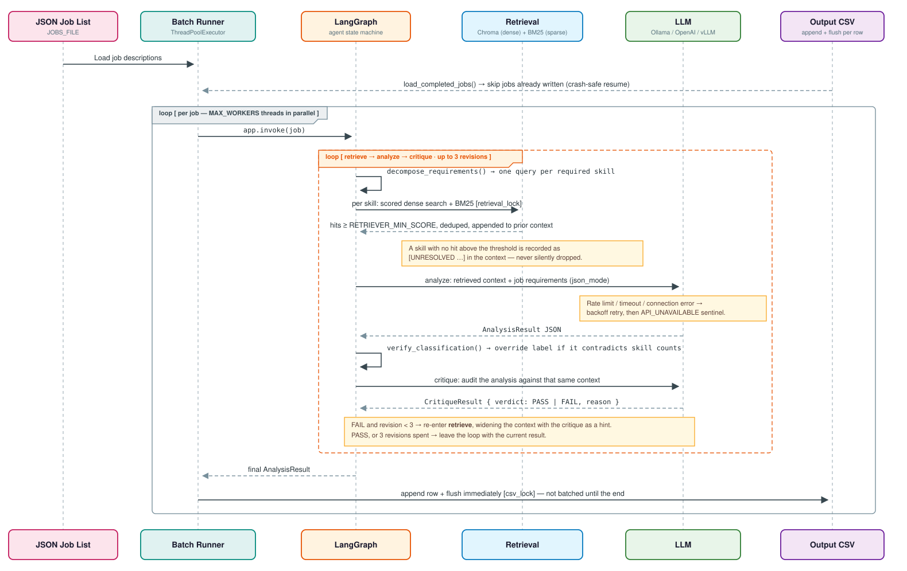
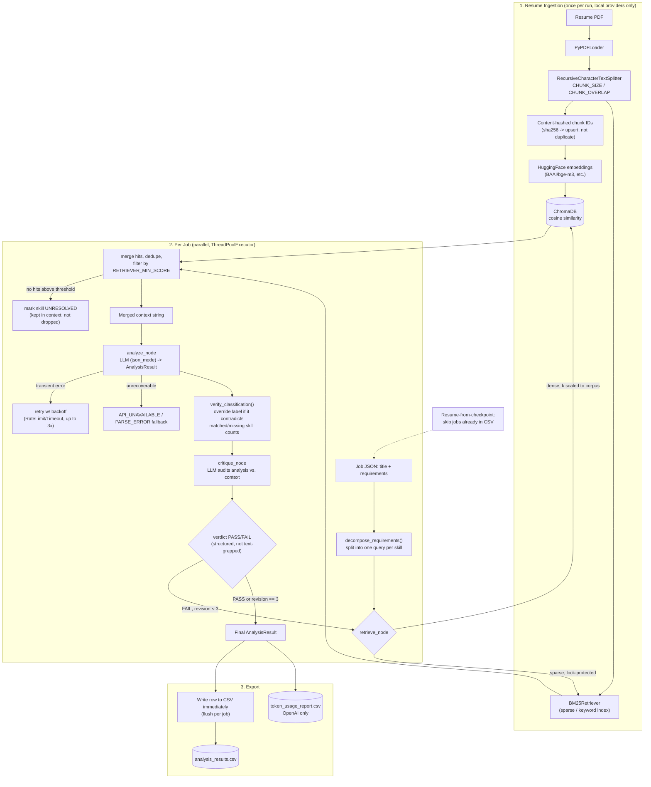

# AI Resume Matcher & Gap Analyzer

## 📖 Overview

This project is a local-first **Batch RAG (Retrieval-Augmented Generation)** pipeline designed to automate technical resume screening.

It indexes a PDF resume, performs hybrid semantic + keyword search against a database of job descriptions, and provides a structured "Gap Analysis" detailing exactly why a candidate matches (or doesn't match) a role.

> **On privacy:** the default `ollama` provider keeps everything on your machine — no resume text leaves the host. Setting `LLM_PROVIDER` to `"openai"` **sends the full resume text to OpenAI** (retrieval is bypassed on that path entirely). Choose the provider accordingly. Either way, the local ChromaDB store under `VECTOR_DB_PATH` retains resume content on disk until you delete it.

## 🏗 System Architecture



The application is built on a modular "Agentic" workflow with **multi-provider support**:

* **Orchestration:** [LangGraph](https://langchain-ai.github.io/langgraph/) (Manages the state between retrieval and analysis nodes).
* **LLM Inference:** 
  - [Ollama](https://ollama.com/) (Local models: `gpt-oss`, `llama3`, `mistral`, etc.)
  - [OpenAI API](https://openai.com/) (Cloud-based: `gpt-4o`, `gpt-4-turbo`, etc.)
  - [vLLM](https://docs.vllm.ai/) (Alternative open-source inference server)
* **Vector Store:** [ChromaDB](https://www.trychroma.com/) (Dense retrieval for local RAG; bypassed when using cloud providers).
* **Keyword Search:** `BM25Retriever` (Sparse retrieval over the same chunks, so exact tokens like `AWS` or `K8s` aren't missed by embeddings).
* **Embeddings:** HuggingFace via `sentence-transformers` (`all-MiniLM-L6-v2` by default; set `EMBEDDING_MODEL` to override).
* **Validation:** Pydantic (Enforces strict JSON schema for the AI output).
* **Self-Correction:** Built-in reflection/critique loop that re-runs *retrieval* on a failed audit, not just generation.
* **Resilience:** Per-job checkpointing, concurrent workers, and backoff retry on transient provider errors.

---

## 🔄 Pipeline Flow (RAG + Agentic Loop)



**Reading the loop:** each job gets its requirements split into individual skill queries (a blended "whole JD" embedding drowns out any skill that isn't the dominant topic). Each query is retrieved with both dense (Chroma) and sparse (BM25) search, scored, and thresholded — unsupported claims get flagged `UNRESOLVED` instead of silently backfilled with irrelevant chunks. The LLM drafts a structured verdict, a second LLM pass audits it against the same context, and on `FAIL` the graph re-enters **retrieval** (not generation) — since the critique can only fault what retrieval fetched, re-analyzing the same context can't fix a retrieval miss. This repeats up to 3 times before the job is exported as-is.

For cloud providers (`LLM_PROVIDER: "openai"`), the ingestion and retrieve subgraphs above are skipped entirely — the full resume text is loaded once and passed straight into `analyze_node`.

---

## 🤖 Advanced Features

### LLMFactory: Multi-Provider Abstraction

The `LLMFactory` class handles provider-specific configurations:

```python
from cv_matcher.agent import LLMFactory

# Works seamlessly across providers
llm = LLMFactory.get_llm(
    provider="openai",      # or "ollama", "vllm"
    model_name="gpt-4o",    # Provider-specific model name
    json_mode=True,         # JSON-constrained output
    temperature=0.1
)
```

**Supported Providers:**
- `"openai"`: Uses OpenAI API with optional JSON mode
- `"ollama"`: Local or remote Ollama server with format=json support
- `"vllm"`: Compatible with vLLM API endpoints

### Self-Correction Loop (Agent Mode)

The agent workflow includes an intelligent critique system:

1. **Generate**: LLM creates initial analysis JSON
2. **Audit**: Separate LLM reviews the analysis against resume context, returning a structured `PASS`/`FAIL` verdict (not free-text grepping)
3. **Detect**: Identifies hallucinations (claimed skills that don't exist in resume, or missing skills that actually do)
4. **Revise**: On `FAIL`, reroutes back to **retrieval** (not straight to generation) with the critique as a hint — a bad verdict usually means retrieval missed the evidence, so re-running analysis on the same context can't fix it. Up to 3 revision attempts.
5. **Verify**: The stated classification is cross-checked against the model's own matched/missing skill counts and overridden if they disagree
6. **Export**: Final validated result, written to CSV as soon as the job finishes (crash-safe, resumable across restarts)

This ensures higher accuracy, especially with complex job requirements.

### Hybrid Retrieval (Local RAG)

Retrieval is no longer a single blended query per job:

- **Query decomposition**: Requirements are split on delimiters/`and`/`、` so each skill gets its own retrieval query instead of one embedding that skews toward whichever skill dominates the text.
- **Dense + sparse**: Each query hits ChromaDB (dense, cosine similarity) *and* a `BM25Retriever` (sparse/keyword) built from the same chunks — dense embeddings are weak on exact tokens like `AWS`, `K8s`, `Terraform`, which BM25 catches.
- **Relevance filtering**: Hits below `RETRIEVER_MIN_SCORE` are dropped rather than returned as "closest 8 chunks regardless of relevance." Skills with no supporting evidence are marked `UNRESOLVED` in the context instead of silently omitted.
- **Content-addressed chunk IDs**: Chunks are IDed by `sha256` of their content, so re-ingesting the same resume upserts instead of duplicating across runs.

### Token Usage Tracking (OpenAI)

When using `python -m cv_matcher.agent` with OpenAI:
- Each analysis step records prompt and completion tokens
- Token counts accumulate through the revision loop
- `token_usage_report.csv` enables cost tracking and optimization

Example workflow cost calculation:
- 100 jobs × ~400 tokens per job = ~40,000 tokens ≈ $0.12 (with GPT-4o)

---

## 📁 Directory Structure (Updated)

```text
.
├── config.json               # All configuration (paths, models, hyperparameters)
├── example.json              # Example job JSON for testing
├── requirements.txt          # Python dependencies
├── environment.yml           # Conda environment spec
├── architecture.svg          # Sequence diagram of the current pipeline
├── image.png                 # Superseded by architecture.svg (pre-hardening, kept for reference)
│
├── src/
│   └── cv_matcher/           # Main Python package
│       ├── __init__.py
│       ├── utils.py          # Config class, ResumeIngestor, shared types
│       ├── main.py           # Primary batch analysis script (use this to run)
│       ├── agent.py          # Advanced agentic workflow with reflection loop (hardened RAG)
│       ├── update_cv.py      # Single-job gap analysis utility
│       └── gpt_baseline.py   # Optional GPT-4o side-by-side comparison
│
├── tests/
│   └── test_pure_logic.py    # Unit tests for retrieval/scoring/checkpoint logic
│
└── data/
    ├── raw/                  # Your resume PDF(s)
    ├── jobs/                 # Job JSON files
    ├── output/               # Generated CSV reports
    └── chroma_db/            # Auto-generated vector database
```

---

## ⚙️ Prerequisites

1. **Python 3.10+**
2. **Ollama** (for local inference): Download from [ollama.com](https://ollama.com)
   - *Optional: Only needed if `LLM_PROVIDER` is set to `"ollama"` in config.json*
3. **OpenAI API Key** (for cloud-based inference):
   - Set `LLM_PROVIDER: "openai"` in config.json and provide `OPENAI_API_KEY` in your `.env` file
   - *Optional: Only needed if using cloud models*
4. **vLLM Server** (alternative inference):
   - Run your own vLLM server and configure the endpoint in config.json
   - *Optional: Only if using vLLM provider*

---

## 🚀 Installation & Setup

1. **Clone the Repository**
   ```bash
   git clone <your-repo-url>
   cd <your-repo-folder>
   ```

2. **Install Dependencies**
   ```bash
   pip install -r requirements.txt
   ```

   Or with conda:
   ```bash
   conda env create -f environment.yml
   conda activate <env-name>
   ```

3. **Install the Package (required for `src/` layout)**
   ```bash
   pip install -e .
   ```
   This registers `cv_matcher` on your Python path so `python -m cv_matcher.main` or `python -m cv_matcher.agent` works.

4. **Configure Environment Variables (for cloud providers)**
   Create a `.env` file in the project root if using OpenAI or other cloud providers:
   ```bash
   OPENAI_API_KEY=your_openai_key_here
   VLLM_API_KEY=your_vllm_key_here  # Optional, for vLLM provider
   ```

5. **Place Your Files**
   - Copy your **resume PDF** to `data/raw/` and update `RESUME_FILE` in `config.json`.
   - Copy your **jobs JSON** to `data/jobs/` and update `JOBS_FILE` in `config.json`.

6. **Start Local Services** (if using Ollama)
   ```bash
   # Start the Ollama server
   ollama serve
   
   # In another terminal, pull your desired model
   ollama pull gpt-oss:20b  # Default model
   ```

---

## ⚙️ Configuration

All settings are centralized in `config.json` at the project root.

| Variable | Default | Description |
| --- | --- | --- |
| `LLM_PROVIDER` | `ollama` | LLM provider: `"ollama"`, `"openai"`, or `"vllm"` |
| `LLM_MODEL` | `gpt-oss:20b` | Model name for Ollama (e.g., `llama3`, `mistral`, `neural-chat`) |
| `GPT_MODEL` | `gpt-4o` | Model name for OpenAI (e.g., `gpt-4o`, `gpt-4-turbo`, `gpt-3.5-turbo`) |
| `EMBEDDING_MODEL` | `all-MiniLM-L6-v2` | HuggingFace model for vectorizing text. |
| `RESUME_FILE` | `./data/raw/CV.md.pdf` | Path to the candidate's PDF resume. |
| `JOBS_FILE` | `./data/jobs/processed_jobs_schema.json` | Path to the JSON file containing job listings. |
| `VECTOR_DB_PATH` | `./data/chroma_db` | Path to persist the ChromaDB vector store (local only). |
| `OUTPUT_DIR` | `./data/output` | Directory where CSV reports are saved. |
| `CHUNK_SIZE` | `500` | Character limit for splitting the resume (local RAG only). |
| `CHUNK_OVERLAP` | `50` | Character overlap between chunks (local RAG only). |
| `RETRIEVER_K` | `8` | Base number of resume chunks to retrieve per skill query; scaled up automatically for larger resumes (local RAG only). |
| `RETRIEVER_MIN_SCORE` | `0.2` | Minimum relevance score for a retrieved chunk to be kept; below this the requirement is marked `UNRESOLVED` instead (local RAG only, agent mode). |
| `MAX_WORKERS` | `4` | Number of jobs processed concurrently via `ThreadPoolExecutor` (agent mode). |

---

## 📝 Data Preparation

### 1. The Resume

Place your PDF resume in `data/raw/`. Update `config.json` to match the filename:
```json
"RESUME_FILE": "./data/raw/your_resume.pdf"
```

### 2. The Jobs JSON

The system expects a JSON list of job objects in `data/jobs/`. The logic specifically looks for `job_title` and `requirements` (or `description`) fields.

See `example.json` for the expected format:

```json
[
  {
    "job_title": "Senior Python Developer",
    "department": "Engineering",
    "requirements": "Must have 5+ years of Python, Django, and AWS experience..."
  }
]
```

---

## 🏃 Usage

### Primary Scripts

**Option 1: Basic Analysis** (Recommended for local inference)
```bash
python -m cv_matcher.main
```
- Uses `LLM_PROVIDER` and `LLM_MODEL` from `config.json`
- For local Ollama: Enables RAG (Vector Search) for efficient retrieval
- For cloud providers: Disables RAG and loads the full resume text

**Option 2: Advanced Agentic Workflow** (With self-correction)
```bash
python -m cv_matcher.agent
```
- Includes a built-in **reflection/critique loop**
- Automatically detects and fixes LLM hallucinations
- Up to 3 revision attempts per job, each re-entering retrieval
- Processes jobs concurrently (`MAX_WORKERS`) and writes each result as it finishes
- **Resumable**: re-running skips jobs already present in the output CSV
- Tracks token usage for cloud providers (OpenAI)
- Exports a separate `token_usage_report.csv` for cost tracking

### Running the Tests

```bash
pytest
```

Covers the pure-logic pieces that don't need an LLM or embedding backend: classification verification, requirement decomposition, relevance-score filtering, chunk-ID hashing, and checkpoint/resume key building.

### Multi-Provider Support

The pipeline automatically adapts based on your `config.json` settings:

| Provider | Behavior | Best For |
| --- | --- | --- |
| **Ollama** (local) | Enables RAG + Vector Search | Privacy-first, cost-free inference |
| **OpenAI** (cloud) | Disables RAG, uses full resume | Fast, high-quality analysis |
| **vLLM** (local/cloud) | Enables RAG + Vector Search | Self-hosted open-source models |

### Execution Flow

When you run either script, the pipeline follows these steps:

1. **Initialization:**
   - Reads `LLM_PROVIDER` from `config.json`
   - For **Ollama/vLLM**: Ingests the resume PDF into ChromaDB (dense) and builds a BM25 index (sparse) from the same chunks
   - For **OpenAI**: Loads the full resume text directly (RAG bypassed for efficiency)

2. **Batch Processing:**
   - Reads `JOBS_FILE`, then skips any job already present in the output CSV (resume-from-checkpoint)
   - Remaining jobs run concurrently across `MAX_WORKERS` threads
   - For **local providers**: Each job's requirements are split into per-skill queries, retrieved via dense + sparse search, and filtered by `RETRIEVER_MIN_SCORE`
   - For **cloud providers**: Uses the full resume text with the LLM's context window

3. **Analysis:**
   - Generates structured JSON output with:
     - `match_classification`: "Strong Match", "Good Match", or "No Match"
     - `matched_critical_skills`: Required skills found in the resume
     - `missing_critical_skills`: Required skills not found in resume
     - `missing_soft_skills`: Soft skills gaps
     - `brief_analysis`: Concise 2-sentence summary
   - Transient provider errors (rate limits, timeouts) are retried with backoff rather than recorded as a result

4. **Quality Assurance** (Agent mode only):
   - `verify_classification` cross-checks the stated label against the model's own matched/missing counts and overrides it on disagreement
   - Critique node audits the analysis against the retrieved context, returning a structured `PASS`/`FAIL` verdict
   - On `FAIL`, reroutes back to **retrieval** with the critique as a hint (up to 3 times)
   - Tracks token usage for cost analysis

5. **Export:**
   - Appends each result to `data/output/analysis_results.csv` as soon as that job finishes, flushed per row
   - For OpenAI: Also generates `token_usage_report.csv`

---

## 📊 Output Explanation

The results are saved to `data/output/analysis_results.csv`. The AI classifies fit into three categories:

| Classification | Criteria |
| --- | --- |
| **Strong Match** | Candidate possesses **70%+** of critical skills |
| **Good Match** | Candidate has **40–70%** of critical skills |
| **No Match** | Candidate lacks core technologies (<40% match) |

### CSV Output

**Main Results** (`analysis_results.csv`):
* **Job Title**: Position name
* **Department**: Used with the title as the resume-from-checkpoint key
* **Classification**: Strong Match / Good Match / No Match
* **Matched Critical Skills**: Mandatory technical skills found in the resume
* **Missing Critical Skills**: Mandatory technical skills gaps
* **Missing Soft Skills**: Soft skills gaps (leadership, communication, etc.)
* **Brief Analysis:** 2-sentence summary of the decision
* **Total Tokens Used:** Token count (cloud providers only)

### Sentinel Values

Some rows carry sentinels instead of real analysis, so infrastructure failures stay distinguishable from genuine mismatches:

| Sentinel | Meaning |
| --- | --- |
| `API_UNAVAILABLE` | The LLM provider was unreachable after all retries. **Not** a judgment about the candidate — re-run these jobs. |
| `PARSE_ERROR` | The model's output could not be parsed as JSON even after the critique loop forced a retry. |

Both appear in the skills columns. Filter them out before treating the CSV as results.

Separately, `[UNRESOLVED — ...]` is appended to the **retrieved context** (not to a CSV column) listing requirements with no resume evidence above `RETRIEVER_MIN_SCORE`. It tells the model to make no claim either way rather than inferring from unrelated chunks, so it may or may not surface in `Brief Analysis`. Frequent `UNRESOLVED` markers in console output usually mean the threshold is set too high.

**Token Report** (`token_usage_report.csv`, OpenAI only):
* **Job Title**: Position name
* **Prompt Tokens**: Tokens consumed by input
* **Completion Tokens**: Tokens generated in output
* **Total Tokens**: Sum for cost calculation

---

## ⚠️ Known Limitations

Understood and deliberately out of scope for now — worth knowing before relying on the output:

* **Job descriptions are trusted input.** `requirements` text is interpolated into the prompt without sanitization. If you feed in scraped or third-party postings, a crafted posting could influence its own classification. Only run job data you trust.
* **The critique can only audit what retrieval fetched.** Re-running retrieval on a failed audit (with the critique as a hint) mitigates this, but a skill that never surfaces above the relevance threshold across all attempts stays invisible to the auditor.
* **`RETRIEVER_MIN_SCORE` is not portable.** Relevance scores vary by embedding model and Chroma version. The `0.2` default is a starting point, not a tuned value — calibrate it against your own resume and model before trusting `UNRESOLVED` markers.
* **Classification percentages are model-reported.** `verify_classification` enforces that the label agrees with the model's own matched/missing lists, but those lists are still the model's judgment, not ground truth.
* **Test coverage is unit-level only.** The suite covers pure logic; retrieval quality, prompt behavior, and the end-to-end graph are verified manually.
* **Resume PII persists on disk.** The ChromaDB store keeps resume content indefinitely with no TTL or purge command. Delete `VECTOR_DB_PATH` manually when you're done.

---

## 🛠 Troubleshooting

* **`ConnectionRefusedError` when using Ollama**: Ensure Ollama server is running (`ollama serve` in another terminal).
* **`OPENAI_API_KEY not found` error**: Verify `.env` file contains your OpenAI key when using `LLM_PROVIDER: "openai"`.
* **`FileNotFoundError`**: Verify that `data/raw/` and `data/jobs/` exist and contain the files defined in `config.json`.
* **`⚠️ Config file not found`**: Always run scripts from the **project root** so that `config.json` is found correctly.
* **JSON parsing errors**: In agent mode, an unparseable response is fed back through the critique loop as a forced retry. If it still fails after 3 attempts the row is written with `PARSE_ERROR` and the batch continues.
* **Rows containing `API_UNAVAILABLE`**: The provider was unreachable after retries. Delete those rows from the CSV and re-run — the checkpoint logic will reprocess only the missing jobs.
* **Everything comes back `UNRESOLVED`**: `RETRIEVER_MIN_SCORE` is likely too high for your embedding model. Lower it (start at `0.0` to disable filtering) and tune upward from the scores printed during retrieval.
* **`sqlite3.OperationalError: database is locked`**: Chroma's SQLite backend under concurrency. Retrieval is already lock-protected; if it persists, lower `MAX_WORKERS`.
* **Empty or incorrect output**: Ensure your resume PDF is valid and your jobs JSON has `job_title` and `requirements` fields.
* **Low token usage reported**: If using local providers (Ollama/vLLM), token usage may not be tracked. This is expected behavior.

### Debugging Tips

- **Enable verbose logging**: Check console output during execution; the pipeline prints each step:
  - `🔄 Initializing Embedding Model` → Vector store loading
  - `🔍 Node: Retrieving context chunks` → Retrieval (per-skill queries, RAG enabled)
  - `📄 Node: Loading FULL resume text` → Retrieval bypassed (cloud provider)
  - `🤖 Node: Generating Analysis (Draft N)` → LLM inference, N = revision attempt
  - `⚠️ Classification mismatch` → `verify_classification` overrode the model's label
  - `🧐 Node: Auditing Output` → Quality checks
  - `🔄 Hallucination detected!` → Critique failed; re-entering retrieval
  - `⏭️ Resuming` → Jobs skipped because they're already in the output CSV

- **Test with a single job**: Create a minimal `test_job.json` with one entry to debug issues faster. Set `MAX_WORKERS` to `1` to keep console output readable while debugging.

- **Check token usage**: For cloud providers, review `token_usage_report.csv` to estimate API costs.